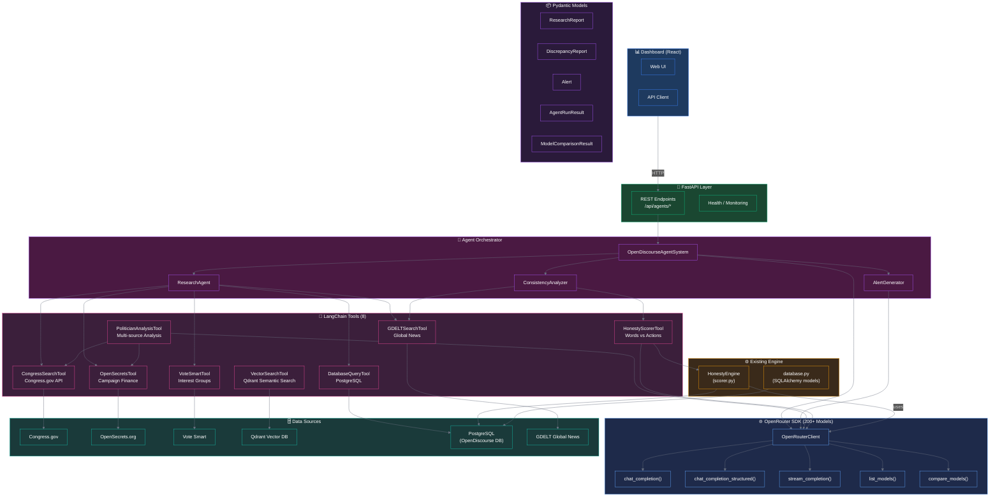
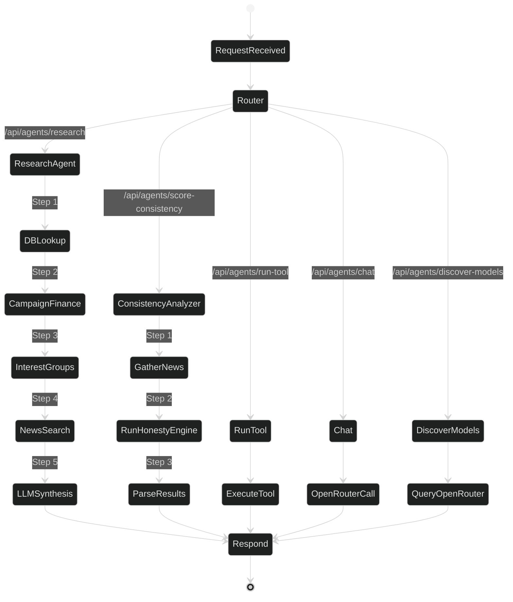
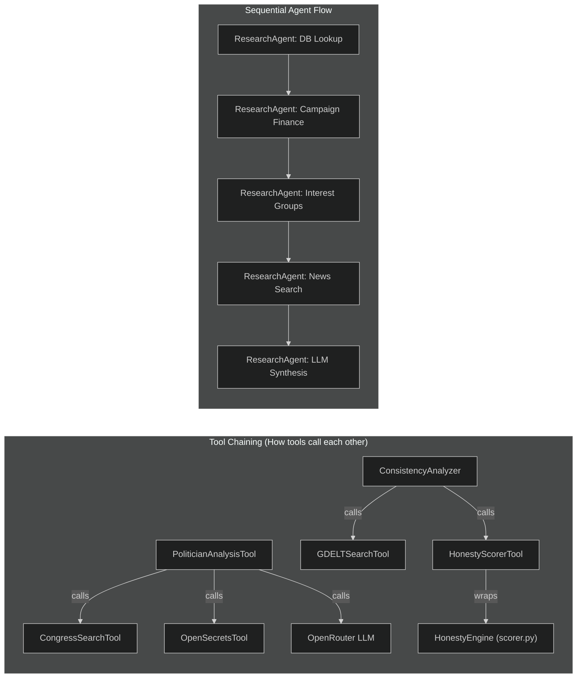
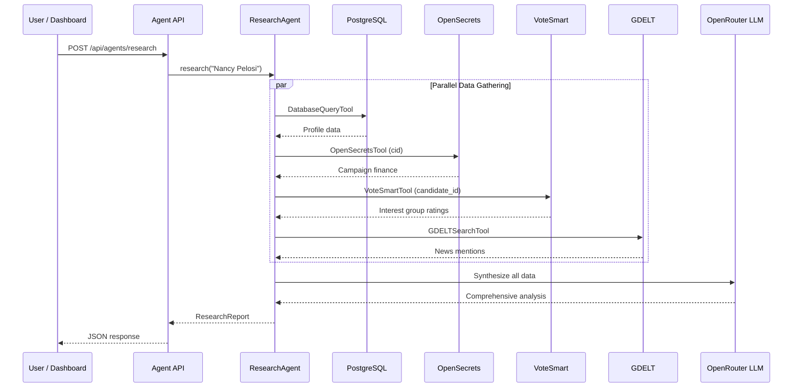
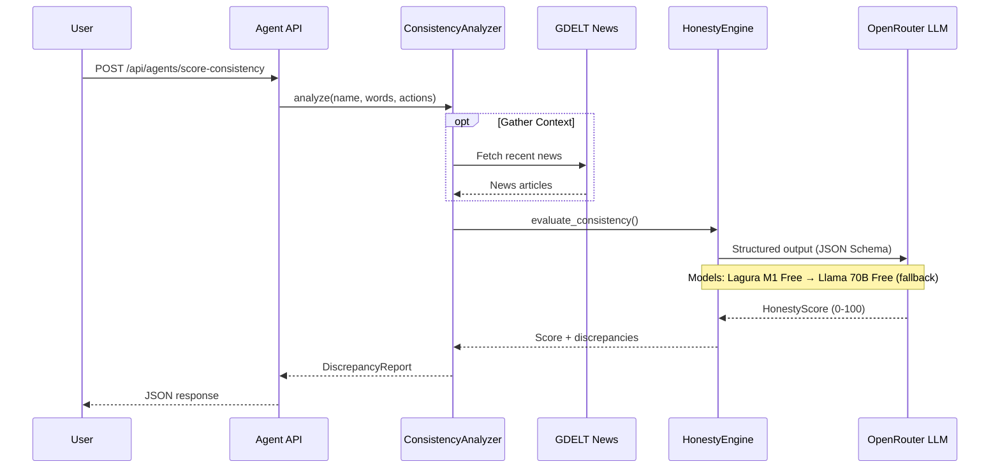
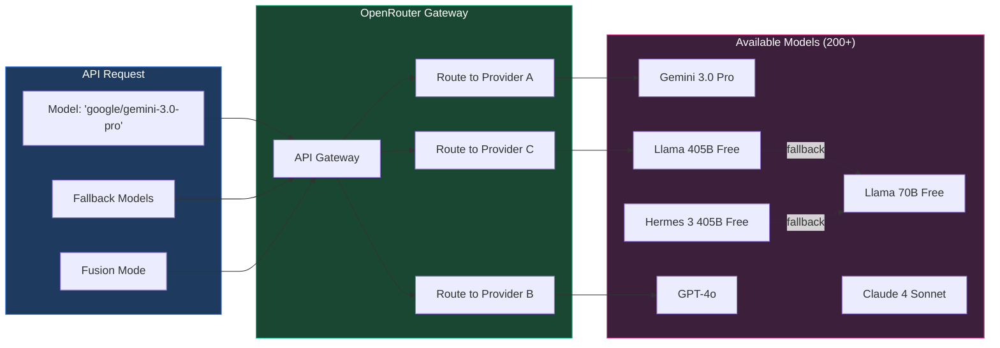
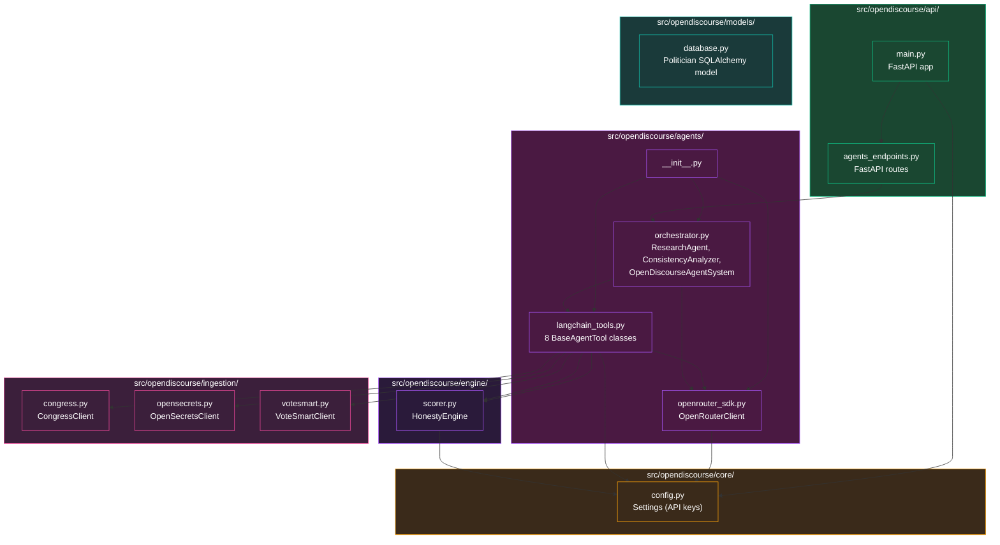

# OpenDiscourse Agent Architecture

> Visual representation of the agent system — tools, agents, data sources, and their interactions.
> These diagrams auto-render as interactive graphs on GitHub and VS Code (Mermaid Preview extension).

---

## 1. System Architecture Overview

---

## 2. Agent Workflow / Orchestration

---

## 3. Tool Dependency / Chaining Graph

This shows how tools call **each other** (not just agents calling tools):

---

## 4. Data Flow: Research Agent (Sequence)

---

## 5. Data Flow: Consistency Scoring (Sequence)

---

## 6. OpenRouter Model Routing

---

## 7. Module Dependency / Import Graph

---

## 8. Available Tools Reference

| Tool | Name | Data Source | Cost | Calls Other Tools |
|------|------|-------------|------|-------------------|
| 🔍 **CongressSearchTool** | `congress_search` | Congress.gov API | Free* | — |
| 💰 **OpenSecretsTool** | `opensecrets_finance` | OpenSecrets.org | Free (200 calls/day) | — |
| 📊 **VoteSmartTool** | `votesmart_ratings` | Vote Smart API | Free | — |
| 🔎 **VectorSearchTool** | `vector_search` | Qdrant (local) | Free | — |
| 👤 **PoliticianAnalysisTool** | `analyze_politician` | Multi-source + LLM | LLM cost | CongressSearchTool, OpenSecretsTool, OpenRouter |
| ⚖️ **HonestyScorerTool** | `honesty_score` | OpenRouter LLM | LLM cost (free models avail.) | HonestyEngine (internal) |
| 🗄️ **DatabaseQueryTool** | `database_query` | PostgreSQL (local) | Free | — |
| 📰 **GDELTSearchTool** | `gdelt_news_search` | GDELT Project | Free | — |

---

## 9. Glossary

| Term | Definition |
|------|------------|
| **OpenRouter** | Unified API gateway providing access to 200+ LLMs (free + paid) |
| **LangChain Tool** | A callable function with a name, description, and typed input schema |
| **Agent** | An autonomous workflow that chains multiple tool calls with LLM reasoning |
| **Orchestrator** | Top-level coordinator that routes requests to the right agent |
| **Honesty Engine** | The core LLM evaluation that scores a politician's Words vs Actions |
| **Fusion Mode** | OpenRouter panel routing — multiple models evaluate and synthesize a judge response |
| **Fallback Chain** | Ordered list of models; if primary fails (rate limit, etc.), next model is tried |
| **Structured Output** | JSON Schema-constrained LLM output — forces the model to return valid typed data |