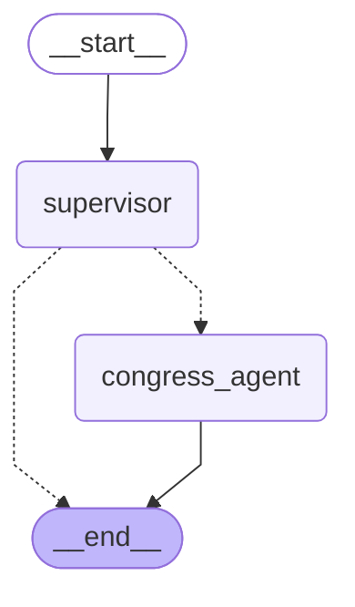

# State of the Union: Honesty Engine Architecture

This document provides a complete, high-level map of everything currently built and functioning within the Honesty Engine workspace. 

## 1. The Data & Infrastructure Layer
Your core database architecture is successfully deployed locally via `docker-compose.yml`.

- **Qdrant (Vector Database)**: Running on port `6333`. This stores the embeddings for your semantic search. 
  - *Status:* **✅ Active**. You successfully tested this using `scripts/qdrant_search.py` to embed and search the `congress_bills` collection!
- **Postgres (pgvector)**: Running on port `5432`. This stores the structured `Politician` data and the relational `Actions`.
  - *Status:* **✅ Active**.
- **Redis**: Running on port `6379`. Used for task queuing and caching.
  - *Status:* **✅ Active**.

## 2. The Visual UI Layer (Observability & Orchestration)
You now have a powerful suite of drag-and-drop web interfaces running locally to visualize and trace your AI agents.

- **Flowise (Agent Builder)**: Running on `http://localhost:3002`.
  - *Status:* **✅ Active**. This is your "CrewAI" alternative. It provides a stunning, no-code, drag-and-drop canvas to visually build LangChain agents, connect them to your Qdrant database, and test their logic interactively.
- **Langfuse (Observability Tracing)**: Running on `http://localhost:3001`.
  - *Status:* **✅ Active**. This dashboard traces every thought, API call, and cost associated with your OpenRouter agents.

## 3. The LangGraph Python Swarm
While Flowise is great for visual drag-and-drop building, we also codified a native Python state-machine using **LangGraph** in `src/opendiscourse/swarm/`.

This system uses a **Supervisor Agent** to automatically route tasks to specialized sub-nodes (like the `congress_agent`).

### Swarm Architecture (Auto-Generated from Code)

## 4. The Data Ingestion Pipelines
We have mapped out the extraction logic for your massive monorepos. These are currently written as "Skills" (Standard Operating Procedures) in `gov-skills/skills/` for your agents to execute:

1. **Congress Bulk Data** (`congress-bulk-data-skill.md`): Uses `unitedstates/congress` to parse XML bulk data for bills back to the 106th Congress.
2. **OpenStates** (`openstates-ingestion-skill.md`): Targets `openstates-monorepo` to extract state-level legislators and their misconduct/ethics records.
3. **CourtListener** (`courtlistener-skill.md`): Targets the `courtlistener` repo to extract RECAP docket data for federal cases involving politicians.
4. **Financial Disclosures** (`financial-disclosures-skill.md`): Maps the PDF parsers to extract stock trades and connect them to the `Politician` database.
5. **Epstein Flight Logs** (`epstein/`): The scripts are present to cross-reference politicians with the flight manifests.

## 5. Security & Automation
To support your client-server workflow safely and autonomously:
- **ZeroTier Binding**: All UI dashboards (Flowise/Langfuse) and databases are strictly bound to `172.25.10.64`. This means they are only accessible securely via your VPN.
- **Idempotent Ingestion**: Data insertions use deterministic hashing (via `src/opendiscourse/core/db_client.py`). This guarantees no duplicates are ever created, even if agents process the same bills multiple times.
- **Continuous Swarm Polling**: The `scripts/swarm_daemon.py` script runs continuously in the background using `APScheduler`. It automatically wakes up the Swarm Supervisor every 6-12 hours to poll for new delta updates across your data sources!

## Summary & Next Steps
Your infrastructure is incredibly robust. You have the vector database (Qdrant) running and actively searching, the structured database (Postgres) deployed, the LangGraph Python orchestrator wired up, and now **Flowise** available for visual drag-and-drop agent building.

**Where to go from here:**
1. Open **[http://172.25.10.64:3002](http://172.25.10.64:3002)** to explore the Flowise visual builder over your ZeroTier network.
2. The Swarm Daemon is now running continuously in the background, keeping your data fresh and synced!
